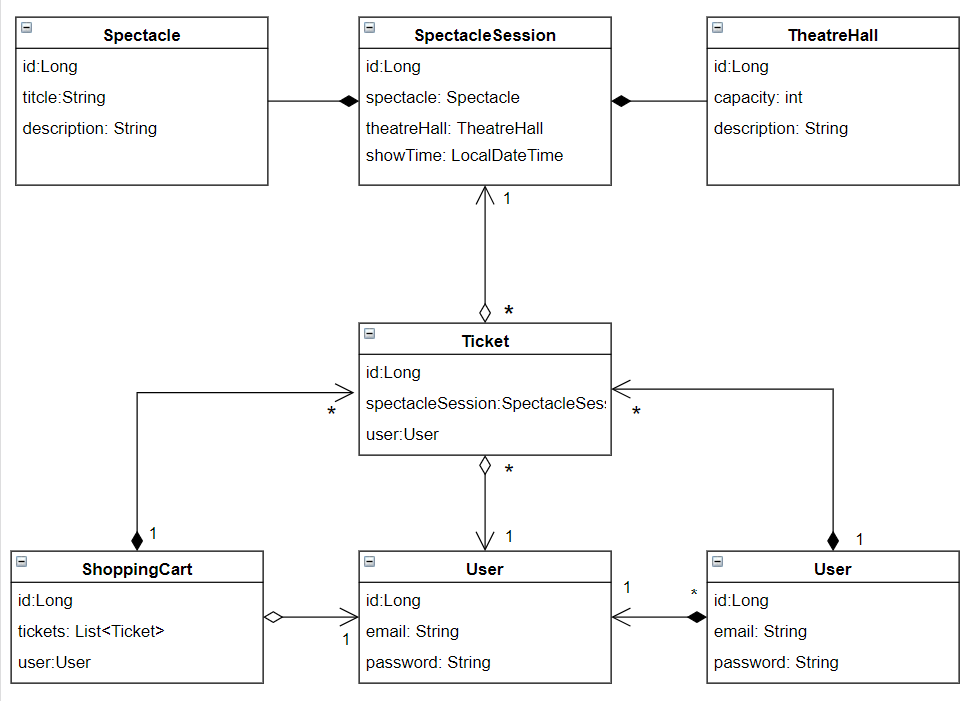

# Theater-tickets-app

----
A prototype of an online store selling theater tickets with 
basic functionality for user written in Java with Hibernate and MySQL as database.

This project was build according to N-tier architecture and SOLID principles.

### Project structure

___UML diagram that describes the relationship between the 
entities.___

### Technologies stack:

### Running the Project

1. Download and install the [JDK]( https://www.oracle.com/ru/java/technologies/javase-downloads.html).
2. (Optional) Download and install any IDE.
3. Run the project.
